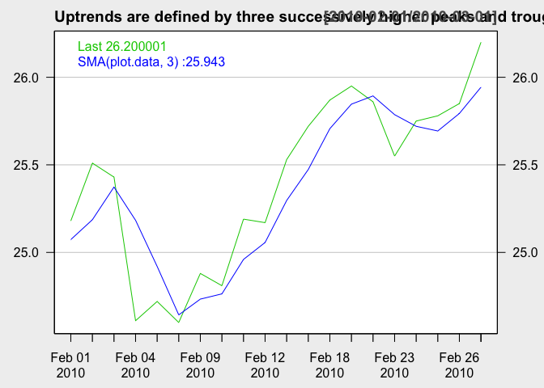

First header
============

    options(warn=-1)
    options("getSymbols.warning4.0"=FALSE)
    suppressMessages(library(quantmod))

Second header
=============

    symbols=c('SCHG')
    getSymbols(symbols, from="2009-10-01", to="2011-10-20")

    ## [1] "SCHG"

    plot.data<-Cl(SCHG)
    options(repr.plot.width=12, repr.plot.height=8)
    chartSeries(
        plot.data["2010-02-01/2010-03-01"],
        name="Uptrends are defined by three successively higher peaks and troughs",
        theme=chartTheme('white'),
        legend=NULL,
        TA=c("addTA(SMA(plot.data,3),col='blue', on=1, legend=NULL)")
    )

    rm(SCHG)
